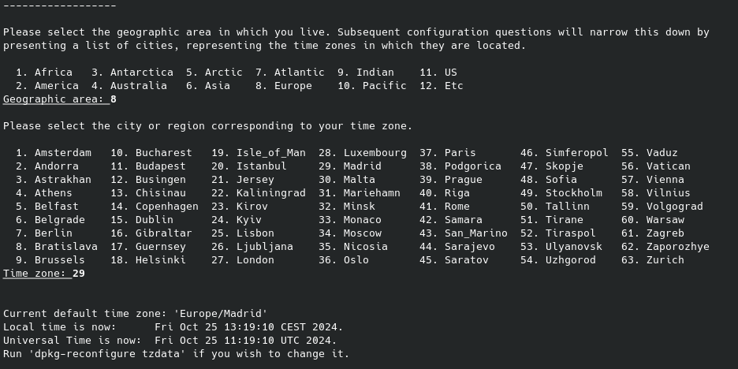
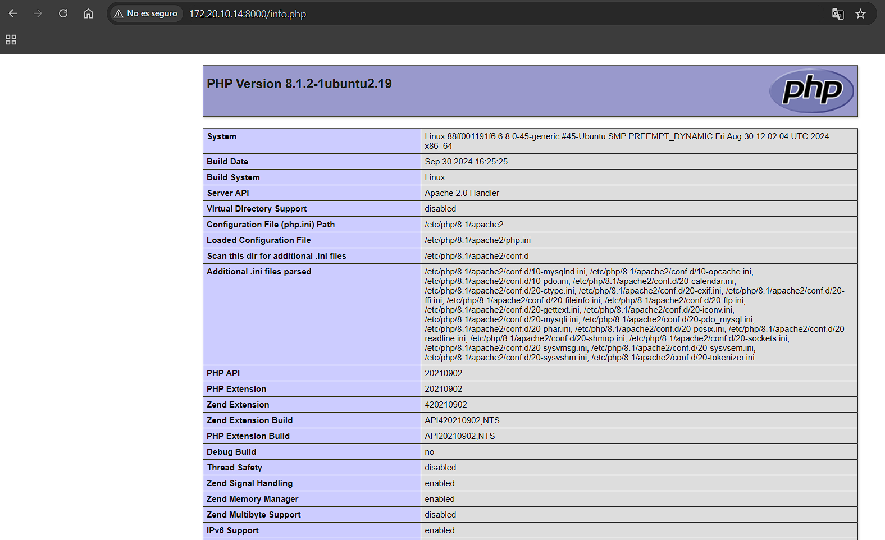
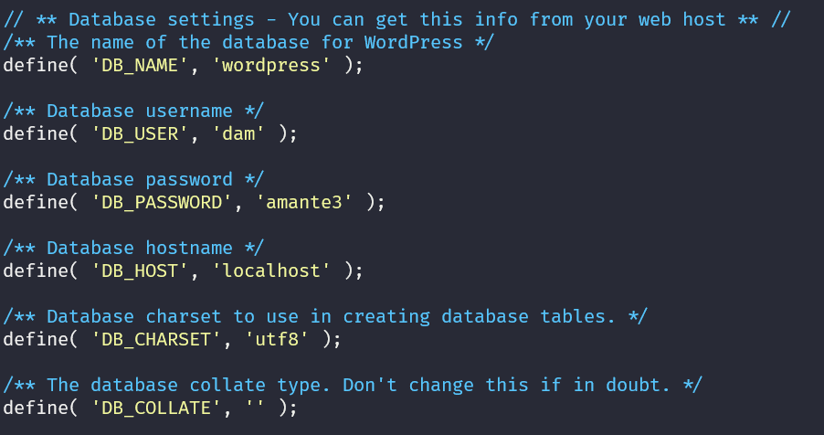
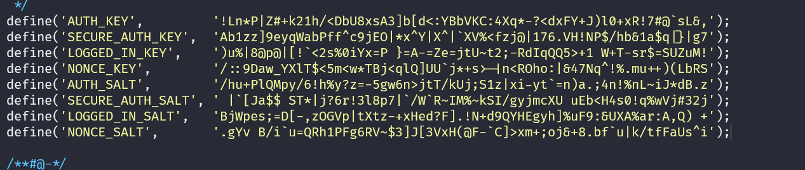

# Tarea 4

---
### **Apartado 1**
#### ***Utiliza la imagen de Ubuntu , tag 22 y apoyandote en esta guía sigue sus instrucciones para instalar LAMP en dicho contenedor.***

`sudo docker run -it ubuntu:22.04`

`apt update` # Actualiza la lista de paquetes


#### ***Crea un contenedor con la imagen de Ubuntu 22.04 y ejecuta el comando tail -f /dev/null para mantenerlo en ejecución.***

`sudo docker run -d --name cnt_ubuntu ubuntu:22.04 tail -f /dev/null` 

`sudo docker ps` # Para verificar que el contenedor está activo

`docker exec -it cnt_ubuntu sh` # Para ingresar al contenedor

#### Una vez dentro vamos a instalar LAMP en el contenedor

`apt update` # Actualiza la lista de paquetes

`apt install -y apache2 apache2-utils` # Instala Apache

` apt install -y mariadb-server mariadb-client` # Instala MariaDB


` service apache2 start` # Inicia el servicio de Apache


`  apt install -y php php-mysql libapache2-mod-php` # Instala PHP

---
**Configuración de MariaDB**

*Primero, se nos pedirá la contraseña de root, que dejaremos en blanco. Después, nos solicitará cambiarla; En el siguiente ponemos NO y depues seleccionamos "Y" en cada opción para completar la configuración restante.*

``` bash
service mariadb start
mysql_secure_installation
 ```

Ahora instalamos PHP
 `apt install -y php php-mysql libapache2-mod-php `

*Selecionaremos las siguientes opciones para configurar la region y la zona geografica*

1. `Pulsaremos 8 para seleccionar la zona geográfica "Europe"`
2. `Pulsaremos 29 para seleccionar la región "Madrid"`

---


*Probamos que todo este funcionando correctamente y reiniciamos el servicio de apache*
```
echo "<?php phpinfo(); ?>" | tee /var/www/html/info.php
service apache2 restart
```
*Acedemos al navegador para verificar*
`http://(ip de la maquina)/info.php`


---
### **Apartado 2**

#### ***Instalar Wordpress en el contenedor de Ubuntu 22.04***

Instalar dependencias de Wordpress
``` bash
apt install ghostscript \
            php-bcmath \
            php-curl \
            php-imagick \
            php-intl \
            php-json \
            php-mbstring \
            php-mysql \
            php-xml \
            php-zip
```

Crear carpeta para Wordpress e instalamos wordpress
``` bash
mkdir /var/www/html/wordpress
chown www-data: /srv/www
curl https://wordpress.org/latest.tar.gz | tar zx -C /srv/www
```
#### Configuramos apache en WordPress

``` bash
apt update
apt install nano
```
*Editamos ael archivo de configuración*
``` bash
touch /etc/apache2/sites-available/wordpress.conf
nano /etc/apache2/sites-available/wordpress.conf
```
*Pegamos dentro:*
``` bash
<VirtualHost *:80>
     ServerAdmin webmaster@localhost
     DocumentRoot /srv/www/wordpress
     ServerName wordpress.local
     ServerAlias www.wordpress.local
     <Directory /srv/www/wordpress>
         Options FollowSymLinks
         AllowOverride All
         Require all granted
     </Directory>
     ErrorLog ${APACHE_LOG_DIR}/error.log
     CustomLog ${APACHE_LOG_DIR}/access.log combined
 </VirtualHost>
```
*Ahora iniciamos wordpress y reiniciamos apache*

```bash
a2ensite wordpress
service apache2 reload
```

*Aplicamos la siguiente configuración*
```bash
a2enmod rewrite
a2dissite 000-default
```

*Reiniciamos apache*
```bash
service apache2 restart
```

---
### **Apartado 3**

#### Ahora configuraremos la Database
```bash
mysql -u root
CREATE DATABASE wordpress;
CREATE USER 'pedro' IDENTIFIED BY '<your-password>';
GRANT SELECT, INSERT, UPDATE, DELETE, CREATE, DROP, ALTER ON wordpress.* TO 'pedro';
FLUSH PRIVILEGES;
QUIT;
```

```bash
cp /srv/www/wordpress/wp-config-sample.php /srv/www/wordpress/wp-config.php
nano /srv/www/wordpress/wp-config.php
```



*para generara el codigo anterior accede a la siguiente pagina web* 

https://api.wordpress.org/secret-key/1.1/salt/

---

## Finalmente verificamos en el navegador que podemos aceder a wordpress
`http://172.20.10.14:8000/wp-admin/setup-config.php`


